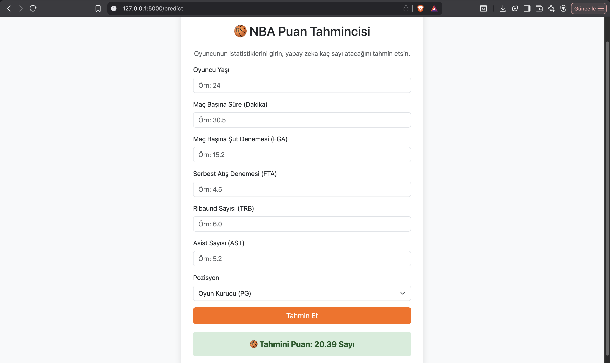

# 🏀 NBA Oyuncu Performans Tahmin Sistemi (Flask & ML)


## 📖 Proje Hakkında
Bu proje, **Makine Öğrenmesi (Machine Learning)** tekniklerini kullanarak NBA oyuncularının sezon istatistiklerine dayalı olarak maç başına atacakları sayıları (PTS - Points Per Game) tahmin eden bir web uygulamasıdır.

Proje, sadece teorik bir model oluşturmakla kalmayıp, bu modeli **Flask** web çatısı (framework) ile entegre ederek son kullanıcının etkileşime geçebileceği gerçek bir ürüne dönüştürmeyi amaçlamıştır.

---

## ⚙️ Uygulama Arayüzü
Kullanıcılar, oyuncunun saha içi istatistiklerini girerek yapay zeka modelinden anlık tahmin alabilirler.


*(Kullanıcının istatistikleri girdiği ana ekran)*

<br> 
*(Modelin tahmin sonrası ürettiği sonuç ekranı)*

> **Örnek Sonuç:** Yukarıdaki görselde, girilen istatistiklere göre model, oyuncunun maç başına ortalama **20.39 sayı** atacağını tahmin etmiştir.

---

## 📊 Veri Seti ve Metodoloji

Projede, 2023-2024 NBA sezonunda forma giyen oyuncuların gerçek maç istatistikleri kullanılmıştır. Modelin geliştirilme sürecinde aşağıdaki veri bilimi adımları uygulanmıştır:

### 1. Veri Ön İşleme (Preprocessing)
* **Veri Temizliği:** Veri setindeki eksik değerler (Null values) analiz edilerek temizlenmiştir.
* **Kategorik Dönüşüm:** Modelin matematiksel işlem yapabilmesi için kategorik veriler (Örn: Oyuncu Pozisyonu), `Dummy Variables` yöntemiyle sayısal verilere dönüştürülmüştür.

### 2. Model Seçimi ve Algoritma
* **Çoklu Doğrusal Regresyon (Multiple Linear Regression):** Birden fazla bağımsız değişkenin (Yaş, Süre, Şut, Asist vb.) hedef değişken (Puan) üzerindeki etkisini ölçmek için bu algoritma tercih edilmiştir.

### 3. Model Optimizasyonu: Backward Elimination
Modelin başarısını artırmak için **Geriye Doğru Eleme (Backward Elimination)** tekniği uygulanmıştır.
* İstatistiksel olarak anlamsız olan (P-value değeri yüksek olan / 0.05'ten büyük) değişkenler tek tek modelden çıkarılmıştır.
* Bu sayede model gürültüden arındırılmış ve sadece skoru gerçekten etkileyen faktörlere odaklanması sağlanmıştır.

---

## 💻 Uygulama Özellikleri

Geliştirilen sistem şu girdileri analiz ederek tahmin üretir:
* **MP (Minutes Played):** Oyuncunun maç başına aldığı süre.
* **FGA (Field Goal Attempts):** Şut denemesi.
* **FT (Free Throws):** Serbest atış isabeti.
* **AST (Assists):** Asist sayısı.
* **Age (Yaş):** Oyuncunun yaşı.
* *(Ve model tarafından anlamlı bulunan diğer istatistikler)*

**Sonuç:** Sistem, bu verileri işleyerek *"Bu oyuncu, bu performans verileriyle maç başına ortalama X sayı atar"* şeklinde bir çıktı üretir.

---

## 🛠️ Kurulum ve Çalıştırma

Projeyi kendi bilgisayarınızda çalıştırmak için:

### 1. Gereksinimleri Yükleyin
Proje klasöründe terminal açarak gerekli kütüphaneleri yükleyin:
```bash
pip install -r requirements.txt
```
### 2. Uygulamayı Başlatın
Flask sunucusunu ayağa kaldırın:

```bash
python app.py
```
3. Tarayıcıda Açın
Terminalde verilen adrese (genellikle http://127.0.0.1:5000/) giderek arayüzü kullanabilirsiniz.
